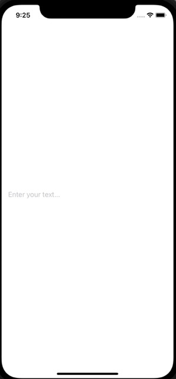
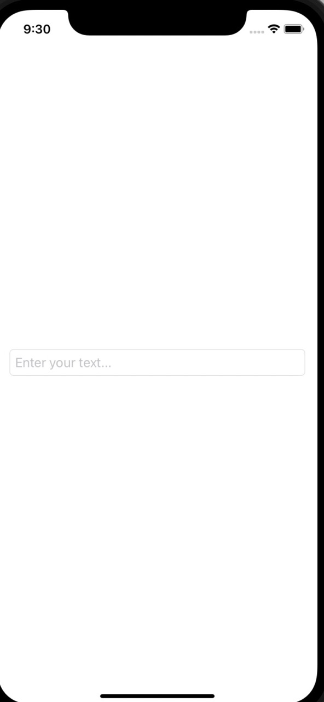
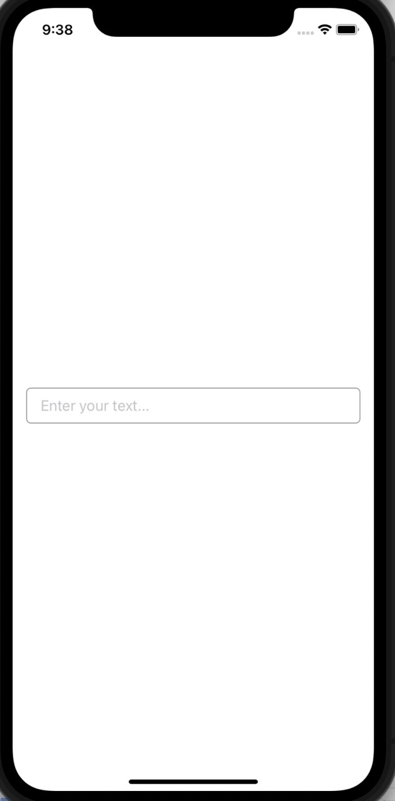
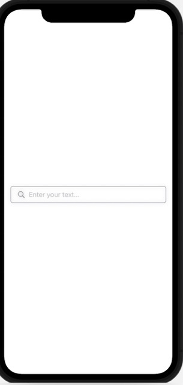

# TextField Styles in SwiftUI
This repo describes how to style the TextFields, or the SwiftUI elements designed to take user
input data. Based on the amazing lessons from CodeWithChris.com, Design course module 1
lesson 5: https://learn.codewithchris.com/courses/take/design/lessons/25824185-lesson-5-styling-textfields.

- [TextField Styles in SwiftUI](#textfield-styles-in-swiftui)
  - [Design](#design)
    - [Simple TextField](#simple-textfield)
    - [Rounded TextField Style](#rounded-textfield-style)
    - [Customized with ZStacks](#customized-with-zstacks)
    - [Further Improvements with ZStack](#further-improvements-with-zstack)
    - [Re-Using Custom Style](#re-using-custom-style)

## Design
### Simple TextField
A text field needs a description as well as a `State` property to bind to
in order to take user input.
```
struct ContentView: View {
    @State var inputText = ""
    var body: some View {
        TextField("Enter your text...", text: $inputText)
            .padding()
    }
}
```
Creates the following simple text field:



### Rounded TextField Style
You can apply a few styles to TextFields, in order to make them stand-out more. This modifier
creates a slight gray rectangle around the TextField:
```
.textFieldStyle(RoundedBorderTextFieldStyle())
```


### Customized with ZStacks
You can further customize the box/ style around the TextField by using a ZStack to place
your own shape behind the text field. In the following instance, you can give the rectangle
a color in order to appear as a border around the TextField:
```
VStack {
    ZStack {
        RoundedRectangle(cornerRadius: 5.0)
            .stroke(.gray)
            .frame(height: 40) // Makes the rectangle smaller
        
        // Place the text field on top
        TextField("Enter your text...", text: $inputText)
            .padding(.horizontal)
    }
}
.padding()
```


### Further Improvements with ZStack
You can add a symbol to make the TextField stick out even more as well as create a shadow for the 
whole thing:
```
ZStack {
    RoundedRectangle(cornerRadius: 5.0)
        .stroke(.gray)
        .frame(height: 40) // Makes the rectangle smaller
    
    // Place the text field on top
    HStack {
        Image(systemName: "magnifyingglass")
            .foregroundColor(.gray)
        TextField("Enter your text...", text: $inputText)
        
    }
    .padding(.horizontal)
}
.shadow(radius: 5.0)
```


### Re-Using Custom Style
You can create your own custom TextField style to re-use over again without the need
to copy/ paste all that code all along. Place your style code in a new struct, which
conforms to the TextField style protocol as shown below in the `CustomTextFieldStyle` file:
```

```
